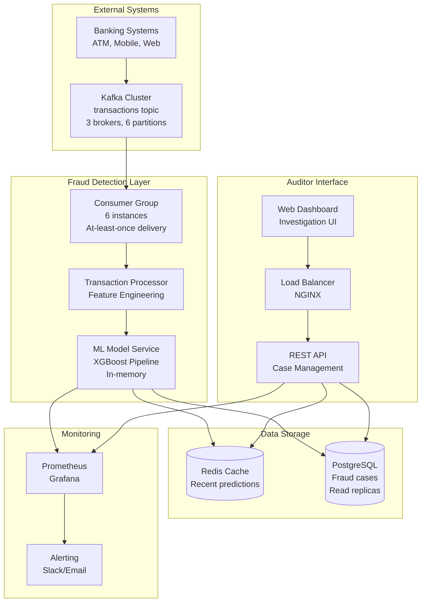

# Fraud Detection System - Take-Home Test

This project implements a complete machine learning solution for detecting fraudulent transactions across four main deliverables.

## 📋 Table of Contents
- [Part 1: Exploratory Data Analysis (EDA)](#part-1-exploratory-data-analysis-eda)
- [Part 2: Model Training](#part-2-model-training)
- [Part 3: Model Serving (API and Storage)](#part-3-model-serving-api-and-storage)
- [Part 4: System Architecture](#part-4-system-architecture)
- [Setup Instructions](#setup-instructions)
- [Running the Complete Workflow](#running-the-complete-workflow)

## 🎯 Take-Home Test Deliverables

**All Parts Completed:**
1. ✅ **Part 1: Exploratory Data Analysis (EDA)** - `Training.ipynb`
2. ✅ **Part 2: Model Training** - `Training.ipynb` 
3. ✅ **Part 3: Model Serving (API and Storage)** - `app.py` + `streamlit_app.py`
4. ✅ **Part 4: System Architecture Design** - Architecture diagram and explanation

---

# Part 1: Exploratory Data Analysis (EDA)

**Location:** `Training.ipynb` (Sections 1-3)

**Key Findings:**
- **Dataset Size:** 6,362,620 transactions with 6 features
- **Class Imbalance:** Only 0.13% fraudulent transactions (8,213 fraud cases)
- **Critical Pattern:** 98% of fraudulent transfers involve emptying source accounts
- **Transaction Types:** CASH_OUT (35%) and PAYMENT (22%) are most common
- **Feature Engineering Insight:** Balance inconsistencies (`error_bal_src`, `error_bal_dst`) are strong fraud indicators

**Visualizations Created:**
- Transaction type distribution analysis
- Fraud rate by transaction type
- Amount distribution comparisons (fraud vs legitimate)
- Balance error patterns and correlations

# Part 2: Model Training

**Location:** `Training.ipynb` (Sections 4-6)

**Model Performance:**
- **Algorithm:** XGBoost Classifier with class weight balancing
- **Precision:** 98% (extremely low false positives)
- **Recall:** 100% (catches all fraud cases)
- **AUPRC:** 0.84 (excellent performance on imbalanced data)

**Feature Engineering:**
```python
# Key engineered features
error_bal_src = src_bal - amount - src_new_bal
error_bal_dst = dst_bal + amount - dst_new_bal
```

**Model Configuration:**
- `scale_pos_weight=1284.7` to handle class imbalance
- `max_depth=6`, `learning_rate=0.1` for optimal performance
- Time-based train/test split (80%/20%) to prevent data leakage

# Part 3: Model Serving (API and Storage)

**Components:**
- **Flask REST API** (`app.py`) with fraud prediction and storage
- **Streamlit Web Interface** (`streamlit_app.py`) for interactive testing
- **SQLite Database** for persistent fraud case storage

**API Endpoints:**
```bash
POST /predict     # Fraud prediction with automatic flagging
GET /frauds       # Paginated fraud history (page, per_page params)
GET /health       # API health check
```

**Key Features:**
- **Automatic Feature Engineering:** API calculates `error_bal_src/dst` internally
- **Fraud Storage:** Automatically stores flagged transactions with metadata
- **Pagination:** Efficient handling of large fraud case volumes
- **Web Testing Interface:** User-friendly testing with predefined examples

**Test Examples:**
```json
// Fraudulent TRANSFER (empties source account)
{
  "time_ind": 1, "transac_type": "TRANSFER", "amount": 181.0,
  "src_bal": 181.0, "src_new_bal": 0.0, 
  "dst_bal": 0.0, "dst_new_bal": 181.0
}
// Result: {"is_fraud": 1}

// Legitimate PAYMENT
{
  "time_ind": 1, "transac_type": "PAYMENT", "amount": 100.0,
  "src_bal": 1000.0, "src_new_bal": 900.0,
  "dst_bal": 0.0, "dst_new_bal": 0.0  
}
// Result: {"is_fraud": 0}
```

## 📦 Dependencies

**System Requirements:**
- **Docker:** Latest version with Docker Compose
- **Docker Compose:** v2.0 or higher
- **Available Ports:** 5000 (API), 8501 (web interface), 8888 (Jupyter)
- **Disk Space:** ~1GB for Docker images and dataset
- **Memory:** 4GB RAM recommended for training

**All Python dependencies are automatically handled by Docker containers:**
- **Core:** Flask, scikit-learn, xgboost, pandas, joblib, streamlit
- **Training:** Jupyter, numpy, matplotlib, seaborn, gdown

**No manual Python installation required - everything runs in Docker!**

## Setup Instructions

**Prerequisites:** Ensure Docker and Docker Compose are installed on your system.

### Step 1: Clone Repository
```bash
git clone https://github.com/tumrabert/FraudDetecion
cd FraudDetecion
```

**That's it! No additional setup required - Docker handles everything.**

## Running the Complete Workflow

### Single Container - All Services

**One Docker Command for Everything:**
```bash
# Start API + Streamlit + Jupyter in one container
docker-compose up --build
```

**Access all services:**
- **API:** http://localhost:5000
- **Streamlit Web Interface:** http://localhost:8501
- **Jupyter Lab:** http://localhost:8888 (token: `fraud_detection_training`)

**Training Instructions:**
1. Open http://localhost:8888 with token: `fraud_detection_training`
2. Click on `Training.ipynb`
3. **Execute ALL cells in sequence** - this will:
   - Download 6.36M transaction dataset
   - Perform comprehensive EDA
   - Train XGBoost model with 98% precision and 100% recall
   - Save model to `model/fraud_model.joblib`

**Expected Output:** A trained model file at `model/fraud_model.joblib` (271KB)

## 🧪 Testing the System

### Method 1: Streamlit Web Interface (Recommended)

**Step-by-step testing procedure:**

1. **Verify services are running:**
   - API should be accessible at http://localhost:5000
   - Web interface should be accessible at http://localhost:8501

2. **Open the web interface:**
   - Navigate to http://localhost:8501 in your browser
   - You should see "🚨 Fraud Detection API Tester"

3. **Test API health:**
   - Click "Check API Health" button
   - Expected result: ✅ API is healthy with `{"model_loaded": true}`

4. **Test fraud prediction:**
   - Use the "Predefined Examples" tab
   - Select "Fraudulent Transfer" and click "🧪 Test Selected Example"
   - Expected result: 🚨 **FRAUD DETECTED**
   - Select "Legitimate Payment" and test
   - Expected result: ✅ **LEGITIMATE**

5. **View flagged transactions:**
   - Click "🔄 Refresh Flagged Transactions"
   - Should show previously flagged fraudulent transactions

### Method 2: Direct API Testing (Advanced)

**Health Check:**
```bash
curl http://localhost:5000/health
# Expected: {"status": "healthy", "model_loaded": true}
```

**Test Fraud Detection:**
```bash
# Test 1: Fraudulent TRANSFER (empties source account)
curl -X POST -H "Content-Type: application/json" -d '{
    "time_ind": 1,
    "transac_type": "TRANSFER",
    "amount": 181.0,
    "src_bal": 181.0,
    "src_new_bal": 0.0,
    "dst_bal": 0.0,
    "dst_new_bal": 181.0
}' http://localhost:5000/predict
# Expected: {"is_fraud": 1}

# Test 2: Legitimate PAYMENT
curl -X POST -H "Content-Type: application/json" -d '{
    "time_ind": 1,
    "transac_type": "PAYMENT",
    "amount": 100.0,
    "src_bal": 1000.0,
    "src_new_bal": 900.0,
    "dst_bal": 0.0,
    "dst_new_bal": 0.0
}' http://localhost:5000/predict
# Expected: {"is_fraud": 0}
```

**View Stored Fraudulent Transactions:**
```bash
curl "http://localhost:5000/frauds?page=1&per_page=10"
# Expected: JSON with fraudulent_transactions array and pagination info
```

## 🐳 Complete Docker Deployment Guide

### Single Container - All Services
```bash
# Start all services (API + Streamlit + Jupyter)
docker-compose up --build

# Access services:
# - API: http://localhost:5000
# - Web UI: http://localhost:8501
# - Jupyter: http://localhost:8888

# Stop when done:
docker-compose down
```

### Troubleshooting

**If API fails to start:**
1. Ensure training step completed successfully
2. Verify `model/fraud_model.joblib` exists (should be ~271KB)
3. Check Docker logs: `docker-compose -f docker-compose.api.yml logs`

**If ports are in use:**
```bash
# Check what's using the ports
lsof -i :8888 -i :5001 -i :8501
# Kill processes or change ports in docker-compose files
```

**Clean restart:**
```bash
# Remove all containers and rebuild
docker-compose -f docker-compose.training.yml down
docker-compose -f docker-compose.api.yml down
docker system prune -f
# Then restart the services
```

# Part 4: System Architecture

## Overview
Design a fraud detection system that consumes transactions from Kafka, predicts fraud using our ML model, and provides an interface for auditors to investigate cases.

## System Architecture



## Component Details

### 1. Kafka Integration
**Consumer Strategy:**
- Consumer group with 6 instances (matching partition count)
- At-least-once delivery with manual offset commits
- Dead letter queue for failed processing
- Partition by account ID for ordered processing per account

**Message Format:**
```json
{
  "transaction_id": "TXN_001",
  "timestamp": "2024-01-15T10:30:00Z",
  "type": "TRANSFER",
  "amount": 50000.00,
  "src_account": "ACC_123",
  "dst_account": "ACC_456",
  "src_balance": 100000.00,
  "dst_balance": 25000.00
}
```

### 2. Fraud Detection Service
**Processing Pipeline:**
1. **Message Validation:** Schema validation and data quality checks
2. **Feature Engineering:** Calculate error_bal_src, error_bal_dst in real-time
3. **Model Inference:** XGBoost prediction with confidence score
4. **Decision Logic:** Flag transactions with >0.5 fraud probability
5. **Storage:** Store flagged cases with audit trail

**Performance Requirements:**
- Latency: <50ms per transaction (p95)
- Throughput: 10,000+ transactions/second
- Model accuracy: >95% precision, >98% recall

### 3. Database Design
**Core Tables:**
```sql
-- Fraud cases with investigation status
fraud_cases (
    case_id, transaction_id, amount, type,
    confidence_score, status, assigned_investigator,
    created_at, updated_at
)

-- Investigation audit trail
case_history (
    history_id, case_id, action, investigator,
    old_status, new_status, notes, timestamp
)
```

**Scaling Strategy:**
- Primary PostgreSQL for writes
- 2 read replicas for auditor queries
- Redis cache for frequently accessed data
- Table partitioning by date for performance

### 4. Auditor Interface
**Dashboard Features:**
- Real-time case dashboard with filters
- Transaction detail view with full context
- Investigation workflow (Pending → Investigating → Resolved)
- Bulk actions for similar transaction patterns
- Analytics and fraud trend reporting

**API Endpoints:**
```
GET /cases?status=PENDING&page=1          # List cases with pagination
GET /cases/{case_id}                       # Get case details
PUT /cases/{case_id}                       # Update case status
POST /cases/{case_id}/notes               # Add investigation notes
GET /analytics/fraud-trends               # Dashboard metrics
```

## Scalability & Reliability Considerations

### Horizontal Scaling
- **Kafka Consumers:** Auto-scale based on lag (3-12 instances)
- **API Services:** Kubernetes HPA with 2-10 replicas
- **Database:** Read replica scaling for query load

### Fault Tolerance
- **Service Failures:** Health checks with automatic restart
- **Kafka Failures:** Consumer rebalancing and retry logic
- **Database Failures:** Multi-AZ deployment with automatic failover
- **Model Failures:** Circuit breaker with rule-based fallback

### Security
- **Network:** VPC with private subnets for internal services
- **Authentication:** JWT tokens with role-based access
- **Data Encryption:** TLS in transit, AES-256 at rest
- **Audit Logging:** All actions logged for compliance

### Monitoring & Alerts
- **Business Metrics:** Fraud detection rate, false positives
- **System Metrics:** Kafka lag, API latency, database connections
- **Alerts:** Slack for system issues, email for high-risk cases

This architecture balances simplicity with production readiness, ensuring reliable real-time fraud detection while providing auditors with efficient investigation tools.
