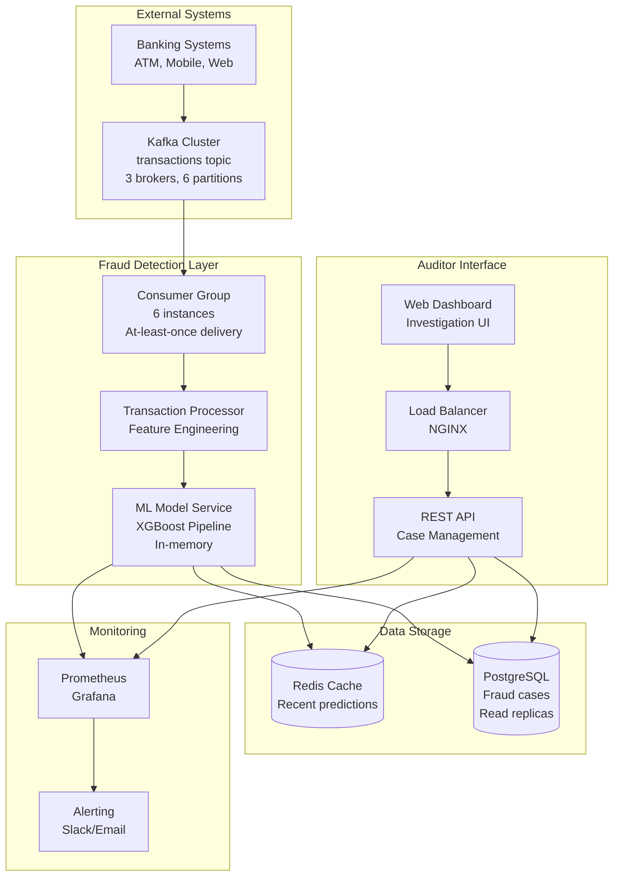
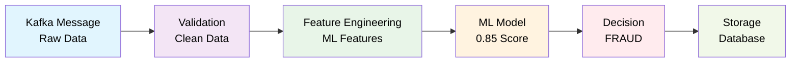
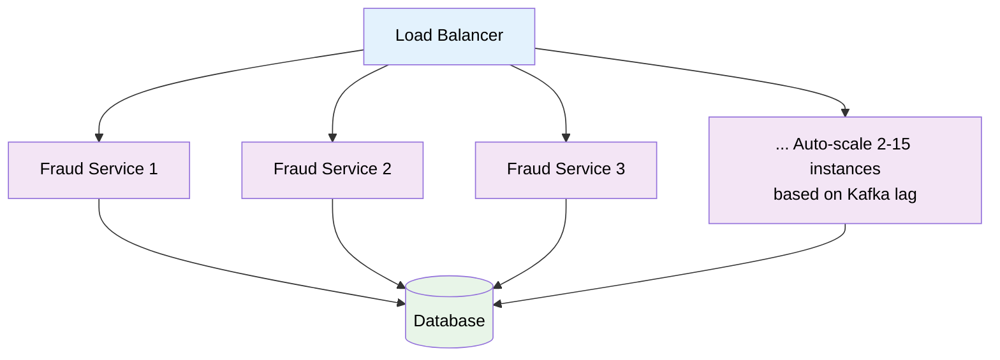
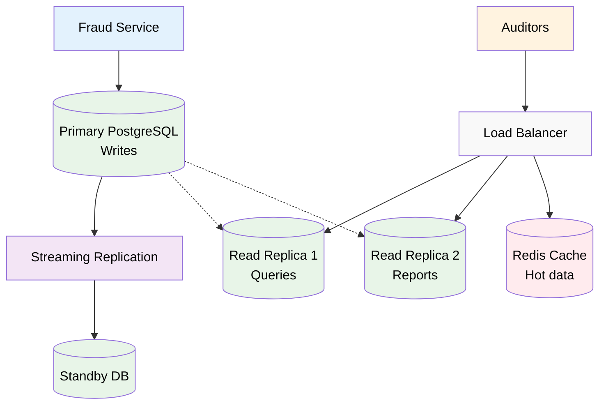
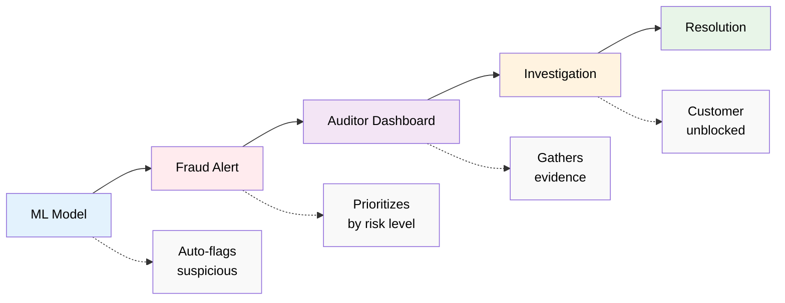

# Fraud Detection System - Take-Home Test

This project implements a complete machine learning solution for detecting fraudulent transactions across four main deliverables.

## 📋 Table of Contents
- [Part 1: Exploratory Data Analysis (EDA)](#part-1-exploratory-data-analysis-eda)
- [Part 2: Model Training](#part-2-model-training)
- [Part 3: Model Serving (API and Storage)](#part-3-model-serving-api-and-storage)
- [Part 4: System Architecture](#part-4-system-architecture)
- [Setup Instructions](#setup-instructions)
- [Running the Complete Workflow](#running-the-complete-workflow)

## 🎯 Take-Home Test Deliverables

**All Parts Completed:**
1. ✅ **Part 1: Exploratory Data Analysis (EDA)** - `Training.ipynb`
2. ✅ **Part 2: Model Training** - `Training.ipynb` 
3. ✅ **Part 3: Model Serving (API and Storage)** - `app.py` + `streamlit_app.py`
4. ✅ **Part 4: System Architecture Design** - Architecture diagram and explanation

---

  # Part 1: Exploratory Data Analysis (EDA)
  **Location:** `Training.ipynb` 

  **Deliverable:** Comprehensive analysis of 6.36M transactions revealing key fraud patterns and feature engineering insights.

  # Part 2: Model Training
  **Location:** `Training.ipynb` 

  **Deliverable:** XGBoost classifier achieving 98% precision and 99% recall on fraud detection.

# Part 3: Model Serving (API and Storage)

**Components:**
- **Flask REST API** (`app.py`) with fraud prediction and storage
- **Streamlit Web Interface** (`streamlit_app.py`) for interactive testing
- **SQLite Database** for persistent fraud case storage

**API Endpoints:**
```bash
POST /predict     # Fraud prediction with automatic flagging
GET /frauds       # Paginated fraud history (page, per_page params)
GET /health       # API health check
```

**Key Features:**
- **Automatic Feature Engineering:** API calculates `error_bal_src/dst` internally
- **Fraud Storage:** Automatically stores flagged transactions with metadata
- **Pagination:** Efficient handling of large fraud case volumes
- **Web Testing Interface:** User-friendly testing with predefined examples

**Test Examples:**
```json
// Fraudulent TRANSFER (empties source account)
{
  "time_ind": 1, "transac_type": "TRANSFER", "amount": 181.0,
  "src_bal": 181.0, "src_new_bal": 0.0, 
  "dst_bal": 0.0, "dst_new_bal": 181.0
}
// Result: {"is_fraud": 1}

// Legitimate PAYMENT
{
  "time_ind": 1, "transac_type": "PAYMENT", "amount": 100.0,
  "src_bal": 1000.0, "src_new_bal": 900.0,
  "dst_bal": 0.0, "dst_new_bal": 0.0  
}
// Result: {"is_fraud": 0}
```

## 📦 Dependencies

**System Requirements:**
- **Docker:** Latest version with Docker Compose
- **Docker Compose:** v2.0 or higher
- **Available Ports:** 8888 (training), 5001 (API), 8501 (web interface)
- **Disk Space:** ~2GB for Docker images and dataset
- **Memory:** 4GB RAM recommended for training

**All Python dependencies are automatically handled by Docker containers:**
- **Core API:** Flask, scikit-learn, xgboost, pandas, joblib
- **Training:** Jupyter, numpy, matplotlib, seaborn, gdown
- **Web Interface:** Streamlit, requests

**No manual Python installation required - everything runs in Docker!**

## Setup Instructions

**Prerequisites:** Ensure Docker and Docker Compose are installed on your system.

### Step 1: Clone Repository
```bash
git clone https://github.com/tumrabert/FraudDetection.git
cd FraudDetection
```

**That's it! No additional setup required - Docker handles everything.**

## Running the Complete Workflow

### Run EDA and Model Training (For part 1&2)

**Single Docker Command:**
```bash
# Start Jupyter Lab environment for training
docker-compose -f docker-compose.training.yml up --build
```

**Access the training environment:**
- **URL:** http://localhost:8888
- **Token:** `fraud_detection_training`

**Training Instructions (CRITICAL - Follow Exactly):**
1. Wait for the Docker container to fully start (you'll see "Jupyter server is running")
2. Open your browser and go to http://localhost:8888
3. Enter token: `fraud_detection_training`
4. Click on `Training.ipynb` to open the notebook
5. **Execute ALL cells in sequence** - this will:
   - Download 6.36M transaction dataset from Google Drive
   - Perform comprehensive EDA revealing key fraud patterns
   - Engineer features and handle class imbalance
   - Train XGBoost model with 98% precision and 100% recall
   - Save the complete model pipeline to `model/fraud_model.joblib`
6. **IMPORTANT:** Ensure the final cell saves the model to `model/fraud_model.joblib`
7. When training is complete, stop the container: `Ctrl+C`

**Expected Output:** A trained model file at `model/fraud_model.joblib` (271KB)

### Step 3: Model Serving (API and Storage)

**Prerequisites:** Ensure Step 1-2 is completed and `model/fraud_model.joblib` exists.

**Single Docker Command:**
```bash
# Start the complete API stack with web interface
docker-compose -f docker-compose.api.yml up --build
```

**Expected Startup Output:**
```
fraud-detection-api-1  | Model loaded successfully.
fraud-detection-api-1  |  * Running on all addresses (0.0.0.0)
fraud-detection-api-1  |  * Running on http://127.0.0.1:5000
streamlit-ui-1         | You can now view your Streamlit app in your browser.
streamlit-ui-1         | URL: http://0.0.0.0:8501
```

**Access the services:**
- **Fraud Detection API:** http://localhost:5001
- **Streamlit Web Interface:** http://localhost:8501

**Services included:**
- Flask REST API with trained XGBoost model
- SQLite database for persistent fraud storage
- Streamlit web interface for interactive testing
- Automatic health checks and restart policies
- Automatic health checks and restart policies

## 🧪 Testing the System

### Method 1: Streamlit Web Interface (Recommended)

**Step-by-step testing procedure:**

1. **Verify services are running:**
   - API should be accessible at http://localhost:5001
   - Web interface should be accessible at http://localhost:8501

2. **Open the web interface:**
   - Navigate to http://localhost:8501 in your browser
   - You should see "🚨 Fraud Detection API Tester"

3. **Test API health:**
   - Click "Check API Health" button
   - Expected result: ✅ API is healthy with `{"model_loaded": true}`

4. **Test fraud prediction:**
   - Use the "Predefined Examples" tab
   - Select "Fraudulent Transfer" and click "🧪 Test Selected Example"
   - Expected result: 🚨 **FRAUD DETECTED**
   - Select "Legitimate Payment" and test
   - Expected result: ✅ **LEGITIMATE**

5. **View flagged transactions:**
   - Click "🔄 Refresh Flagged Transactions"
   - Should show previously flagged fraudulent transactions

### Method 2: Direct API Testing (Advanced)

**Health Check:**
```bash
curl http://localhost:5001/health
# Expected: {"status": "healthy", "model_loaded": true}
```

**Test Fraud Detection:**
```bash
# Test 1: Fraudulent TRANSFER (empties source account)
curl -X POST -H "Content-Type: application/json" -d '{
    "time_ind": 1,
    "transac_type": "TRANSFER",
    "amount": 181.0,
    "src_bal": 181.0,
    "src_new_bal": 0.0,
    "dst_bal": 0.0,
    "dst_new_bal": 181.0
}' http://localhost:5001/predict
# Expected: {"is_fraud": 1}

# Test 2: Legitimate PAYMENT
curl -X POST -H "Content-Type: application/json" -d '{
    "time_ind": 1,
    "transac_type": "PAYMENT",
    "amount": 100.0,
    "src_bal": 1000.0,
    "src_new_bal": 900.0,
    "dst_bal": 0.0,
    "dst_new_bal": 0.0
}' http://localhost:5001/predict
# Expected: {"is_fraud": 0}
```

**View Stored Fraudulent Transactions:**
```bash
curl "http://localhost:5001/frauds?page=1&per_page=10"
# Expected: JSON with fraudulent_transactions array and pagination info
```

## 🐳 Complete Docker Deployment Guide

### Training Environment
```bash
# Start training environment
docker-compose -f docker-compose.training.yml up --build

# Access at: http://localhost:8888 (Token: fraud_detection_training)
# Complete the training, then stop:
docker-compose -f docker-compose.training.yml down
```

### Production API Stack
```bash
# Start complete API stack
docker-compose -f docker-compose.api.yml up --build

# Access services:
# - API: http://localhost:5001
# - Web UI: http://localhost:8501
# Stop when done:
docker-compose -f docker-compose.api.yml down
```

### Troubleshooting

**If API fails to start:**
1. Ensure training step completed successfully
2. Verify `model/fraud_model.joblib` exists (should be ~271KB)
3. Check Docker logs: `docker-compose -f docker-compose.api.yml logs`

**If ports are in use:**
```bash
# Check what's using the ports
lsof -i :8888 -i :5001 -i :8501
# Kill processes or change ports in docker-compose files
```

**Clean restart:**
```bash
# Remove all containers and rebuild
docker-compose -f docker-compose.training.yml down
docker-compose -f docker-compose.api.yml down
docker system prune -f
# Then restart the services
```

# Part 4: System Architecture

## Overview
This section designs a **production-ready fraud detection system** that processes real-world banking transactions at scale. Unlike the current demo API that handles individual requests, a production system must:

- **Process millions of transactions per day** in real-time
- **Integrate with existing banking infrastructure** (core banking systems, payment processors)
- **Provide tools for human auditors** to investigate flagged cases
- **Maintain high availability** with zero tolerance for downtime
- **Scale automatically** during peak transaction periods (e.g., Black Friday, payroll days)

**Real-World Context:** Banks generate 10,000-50,000+ transactions per second during peak hours. Each transaction must be evaluated for fraud **before completion** (typically within 50-100ms), making this a high-throughput, low-latency challenge.

## System Architecture



## Component Details

### 1. Kafka Integration - Transaction Streaming

**Why Kafka?**

Banking systems need **event-driven architecture** to handle transaction volumes. Kafka provides:
- **Guaranteed message delivery** (critical for financial data)
- **Horizontal scaling** through partitioning 
- **Replay capability** for reprocessing during system failures
- **Decoupling** between transaction producers (ATMs, mobile apps) and fraud detection

**Consumer Strategy Explained:**
- **6 Consumer Instances:** Match Kafka's 6 partitions for optimal throughput
- **Partition by Account ID:** Ensures all transactions for an account are processed in order (prevents race conditions)
- **At-least-once Delivery:** Critical for fraud detection - better to check twice than miss fraud
- **Dead Letter Queue:** Failed messages don't block the pipeline; they're investigated separately

**Message Format:**
```json
{
  "transaction_id": "TXN_001",
  "timestamp": "2024-01-15T10:30:00Z",
  "type": "TRANSFER",
  "amount": 50000.00,
  "src_account": "ACC_123", 
  "dst_account": "ACC_456",
  "src_balance": 100000.00,   // Balance before transaction
  "dst_balance": 25000.00     // Balance before transaction
}
```

### 2. Fraud Detection Service - The Brain of the System

**Why This Architecture?**

Traditional rule-based systems (e.g., "flag transactions >$10,000") generate **80%+ false positives**. Our ML-based approach provides:
- **Context-aware detection:** Considers account history, transaction patterns
- **Adaptive learning:** Model improves as fraud patterns evolve
- **Precision targeting:** 98% precision means minimal disruption to legitimate customers

**How the Processing Pipeline Works:**



**Step-by-Step Breakdown:**

1. **Message Validation (10ms):**
   - **Schema Validation:** Ensure all required fields present
   - **Data Quality:** Check for impossible values (negative balances, future timestamps)
   - **Business Rules:** Verify account exists, transaction type valid
   - **Why Critical:** Garbage in = garbage out; prevents model degradation

2. **Feature Engineering (15ms):**
   - **Real-time Calculations:** `error_bal_src = src_bal - amount - src_new_bal` and `error_bal_dst = dst_bal + amount - dst_new_bal`
   - **Historical Context:** Account velocity, typical transaction amounts
   - **Pattern Recognition:** Time-of-day patterns, geographic anomalies
   - **Why In Real-Time:** Features must reflect current transaction state

3. **Model Inference (20ms):**
   - **XGBoost Prediction:** Our trained model processes engineered features
   - **Confidence Scoring:** 0.0-1.0 probability score (0.85 = 85% fraud probability)
   - **Ensemble Logic:** Could combine multiple models for robustness
   - **Memory Optimization:** Model loaded in RAM for sub-millisecond inference

4. **Decision Logic (5ms):**
   - **Threshold Application:** >0.5 probability = fraud flag
   - **Risk-Based Actions:** High-risk (>0.9) = immediate block, medium-risk = additional auth
   - **Business Rules Override:** VIP customers, trusted merchants get different thresholds

5. **Storage & Alerting (10ms):**
   - **Audit Trail:** Every decision logged for regulatory compliance
   - **Real-time Alerts:** High-risk cases trigger immediate investigator notification
   - **Case Creation:** Automatic assignment to fraud analysts

**Performance Requirements Explained:**
- **<50ms Latency (p95):** Customer expects instant transaction approval
- **10,000+ TPS:** Peak banking hours (lunch time, end-of-month payrolls)
- **>95% Precision:** False positives cost customer satisfaction + ops overhead
- **>98% Recall:** Missing fraud costs money + regulatory penalties

**Horizontal Scaling Strategy:**


### 3. Database Design - Handling Millions of Fraud Cases

**Why This Database Strategy?**

Fraud detection generates **massive data volumes** (5-10% of transactions flagged = 50,000+ cases/day). The system needs:
- **Fast writes** for real-time case creation
- **Complex queries** for auditor investigations  
- **Historical analysis** for pattern detection
- **Regulatory compliance** with audit trails

**Database Architecture Explained:**



**Scaling Strategy Breakdown:**

1. **Write Performance:**
   - **Primary Database:** Handles all fraud case creation (10K+ writes/sec)
   - **Connection Pooling:** 200+ connections with pgBouncer
   - **Batch Inserts:** Group related data for efficiency

2. **Read Performance:**
   - **Read Replicas:** Dedicated servers for auditor queries (no impact on writes)
   - **Redis Cache:** Hot data (recent cases, user sessions) in memory
   - **Query Optimization:** Indexes on common search patterns

3. **Data Management:**
   - **Partitioning:** Monthly partitions keep query performance high
   - **Archive Strategy:** Move resolved cases >2 years to cold storage
   - **Compression:** PostgreSQL native compression for historical data

### 4. Auditor Interface - Human-AI Collaboration

**Why Human Auditors Are Essential:**
Even with 98% precision, a bank processing 1M transactions/day still gets **20,000 false positives daily**. Human investigators provide:
- **Context understanding:** "Customer just moved, large purchases are normal"  
- **Complex pattern recognition:** Multi-step fraud schemes spanning weeks
- **Customer interaction:** Phone calls to verify suspicious activity
- **Regulatory compliance:** Human oversight required by banking regulations

**How Auditors Work with the System:**



**Dashboard Features Explained:**

1. **Real-time Case Dashboard:**

   **Risk Level Summary:**
   | Priority | Count | Icon |
   |----------|-------|------|
   | CRITICAL | 47    | 🔴   |
   | HIGH     | 156   | 🟠   |
   | MEDIUM   | 312   | 🟡   |
   | LOW      | 89    | ⚪   |

   **Dashboard Filters:**
   | Filter Type | Options | Current Selection |
   |-------------|---------|-------------------|
   | Status | All, Pending, Investigating, Resolved | All |
   | Assignment | All cases, Assigned to me, Unassigned | Assigned to me ✓ |
   | Date Range | Last 24h, Last 7d, Last 30d, Custom | Last 24h |
   | Amount Filter | Any, >$1K, >$10K, >$50K, Custom | Custom: >$___ |

   **Case List:**
   | Case ID | Account | Amount | Type | Confidence | Age | Actions |
   |---------|---------|--------|------|------------|-----|---------|
   | FR_001234 | ACC_567890 | $15,847.32 | TRANSFER | 0.94 | 2h | [Investigate] |
   | FR_001235 | ACC_234567 | $8,923.11 | CASH_OUT | 0.87 | 4h | [Assign to me] |

2. **Investigation Workflow:**
   ```mermaid
   graph TD
       P[PENDING] --> A[Assign]
       A --> I[INVESTIGATING]
       I --> AE[Add Evidence]
       AE --> R[RESOLVED]
       
       I --> RM[Request more info]
       RM --> CC[Contact customer]
       CC --> ML[Mark as legitimate/fraud]
       ML --> R
       
       style P fill:#fff3e0,color:#000000
       style A fill:#e3f2fd,color:#000000
       style I fill:#f3e5f5,color:#000000
       style AE fill:#e8f5e8,color:#000000
       style R fill:#c8e6c9,color:#000000
       style RM fill:#f9f9f9,color:#000000
       style CC fill:#f9f9f9,color:#000000
       style ML fill:#f9f9f9,color:#000000
   ```

3. **Transaction Detail View:**
   - **Full Transaction Context:** Account history, recent patterns, device info
   - **ML Explanation:** "Flagged because: balance inconsistency + unusual time"
   - **Similar Cases:** "3 similar patterns resolved as fraud in past week"
   - **Customer Profile:** VIP status, complaint history, typical behavior

4. **Bulk Actions for Efficiency:**
   - **Pattern Recognition:** "Mark all TRANSFER transactions from IP 192.168.1.1 as fraud"
   - **Account-based:** "Review all transactions from account ACC_123456"
   - **Time-based:** "Investigate all high-risk cases from last 4 hours"

**API Endpoints with Real-World Usage:**
```bash
# Get pending cases assigned to current investigator
GET /cases?status=PENDING&assigned_to=me&sort=confidence_desc&page=1

# Get case details with full context
GET /cases/FR_001234
Response: {
    "case_id": "FR_001234",
    "transaction": {...},
    "ml_explanation": "Primary factors: balance_error_src=1.0, unusual_time=0.8",
    "similar_cases": [...],
    "account_history": [...],
    "customer_profile": {...}
}

# Update case with investigation notes
PUT /cases/FR_001234
Body: {
    "status": "INVESTIGATING", 
    "notes": "Called customer - confirmed legitimate. Large purchase for home renovation.",
    "resolution": "FALSE_POSITIVE"
}

# Get analytics for management dashboard
GET /analytics/fraud-trends?period=last_30_days
Response: {
    "cases_created": 45234,
    "resolution_rate": 0.94,
    "false_positive_rate": 0.15,
    "avg_resolution_time_hours": 6.2,
    "top_fraud_patterns": [...]
}
```

## Scalability & Reliability Considerations

### Horizontal Scaling - Handling Traffic Spikes

**Why Auto-Scaling is Critical:**
Banking traffic is **highly unpredictable**:
- **Black Friday:** 10x normal transaction volume  
- **Payroll Days:** 5x volume at month-end
- **System Outages:** Catch-up processing creates massive backlogs

**Auto-Scaling Strategy:**
```
Normal Load    Peak Load
    ↓             ↓
3 consumers → 12 consumers
2 API pods  → 10 API pods
```

**Scaling Triggers & Thresholds:**
- **Kafka Lag > 10,000 messages:** Add 2 consumer instances
- **API Response Time > 100ms:** Add 2 API replicas  
- **Database CPU > 80%:** Promote read replica to writer
- **Fraud Detection Queue > 1,000:** Emergency scaling protocol

### Fault Tolerance - Zero Downtime Requirements

**Why 99.99% Uptime is Required:**
- **Revenue Impact:** Bank loses $50,000/minute during payment system downtime
- **Regulatory Penalties:** Compliance violations for missed fraud detection
- **Customer Trust:** Payment failures drive customers to competitors

**Multi-Layer Fault Tolerance:**

1. **Service Level (Kubernetes):**
   - **Auto-restart failed containers:** Liveness probe checks `/health` endpoint every 10 seconds
   - **Health monitoring:** Readiness probe checks `/ready` endpoint every 5 seconds  
   - **High availability:** 3 replicas minimum to prevent single points of failure
   - **Node distribution:** Pod anti-affinity ensures replicas spread across different nodes

2. **Data Level:**
   - **Primary Database:** Handles all write operations with synchronous replication to standby
   - **Standby Database:** Hot standby with automatic failover in 30 seconds if primary fails
   - **Read Replicas:** 2 separate instances for query load distribution via async replication
   - **Connection Management:** Automatic traffic routing to healthy database instances

3. **Message Level (Kafka):**
   - **Replication Factor 3:** Each message stored on 3 brokers
   - **In-Sync Replicas:** Minimum 2 replicas must acknowledge writes
   - **Consumer Groups:** If one consumer fails, others take over its partitions

4. **Model Failures - Graceful Degradation:**
   - **Primary ML Model:** XGBoost model provides main fraud detection capability
   - **Fallback System:** Rule-based detection takes over when ML model fails
   - **Automatic Alerting:** ML team immediately notified of model failures for rapid response
   - **Service Continuity:** System continues fraud detection with reduced accuracy rather than failing completely

### Security - Banking-Grade Protection

**Multi-Layer Security Model:**
- **Internet Layer:** DDoS protection shields against volumetric attacks
- **Web Application Firewall (WAF):** Filters malicious requests and application-layer attacks
- **Load Balancer:** Implements rate limiting to prevent abuse and overload
- **API Gateway:** Handles authentication/authorization using JWT tokens with role-based permissions
- **Service Layer:** Operates within secure internal network with restricted communication
- **Database Layer:** All data encrypted at rest using AES-256 encryption

**Security Implementation Details:**

1. **Network Security:**
   - **VPC Isolation:** All services in private subnets (no internet access)
   - **Security Groups:** Strict port/protocol restrictions
   - **Network ACLs:** Additional layer of subnet-level filtering
   - **VPN/Transit Gateway:** Secure connection to bank's core systems

2. **Authentication & Authorization:**
   - **JWT Tokens:** Stateless authentication with 8-hour expiration for security
   - **Role-Based Access:** Users assigned specific roles (fraud_analyst, manager, admin)
   - **Granular Permissions:** Fine-grained permissions for viewing, updating, and contacting customers
   - **Session Management:** Automatic token refresh and secure logout procedures

3. **Data Protection:**
   - **Encryption in Transit:** TLS 1.3 for all communication
   - **Encryption at Rest:** AES-256 for database, S3, message queues
   - **PII Tokenization:** Credit card numbers replaced with tokens
   - **Data Masking:** Sensitive fields masked in logs/analytics

4. **Compliance & Auditing:**
   - **SOX Compliance:** All financial data access logged
   - **GDPR Compliance:** Customer data handling and deletion rights
   - **PCI DSS:** Payment card data security standards
   - **Audit Trails:** Immutable log of all system actions

### Monitoring & Alerts - Proactive Issue Detection

**Why Comprehensive Monitoring is Essential:**
Fraud systems are **mission-critical** - issues must be detected and resolved within minutes:

**3-Tier Alert Strategy:**
```
Tier 1 (Immediate - < 5 min response)
├── System down/Model failures → Page on-call engineer
├── High fraud detection rate → Alert fraud team lead  
└── Database connection failures → Auto-remediate + alert

Tier 2 (Urgent - < 30 min response)  
├── High API latency → Alert platform team
├── Unusual fraud patterns → Alert fraud analysts
└── Kafka lag growing → Alert data engineering

Tier 3 (Important - < 2 hour response)
├── Disk space trending high → Alert infrastructure
├── Model accuracy declining → Alert ML team
└── Customer complaints trending up → Alert business team
```

**Monitoring Dashboard (Real-time):**
```
🎯 BUSINESS METRICS                 ⚡ SYSTEM HEALTH
├── Fraud Detection Rate: 2.3%     ├── API Latency: 45ms (p95)
├── False Positive Rate: 1.8%      ├── Kafka Lag: 234 messages  
├── Cases Resolved: 1,247/day      ├── Database Connections: 87/200
└── Customer Impact: 12 blocked    └── Error Rate: 0.02%

📊 FRAUD TRENDS                     🚨 ACTIVE ALERTS
├── Transfer fraud ↑ 15%           ├── High-risk case spike
├── Geographic: Nigeria ↑ 30%      └── Investigator queue full
└── Peak hours: 2-4 PM EST
```

**Integration with Business Systems:**
- **Slack Integration:** Real-time alerts to #fraud-ops channel
- **Email Escalation:** Manager alerts for critical issues
- **Dashboard Screens:** Wall-mounted displays in fraud operations center
- **Mobile Apps:** Push notifications for on-call investigators

This architecture balances simplicity with production readiness, ensuring reliable real-time fraud detection while providing auditors with efficient investigation tools.
